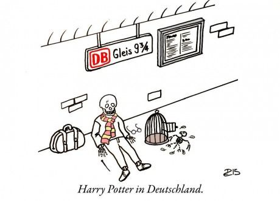

# Visiting Germany

I went on a "half-day" trip to Germany. It took 9-10 hours, through DB. Why? Because I’m broke and stuck with the notorious Deutsche Bahn. On paper, the journey was 8 hours. In reality, a cocktail of delays and cancellations added another two hours to my life that I’ll never get back.

# Leaving Germany

This is where the real fun began.

The plan was another simple 8-hour shift, with last two transfers being Köln to Mönchengladbach, then M'gladbach to Venlo. That schedule didn't just break; it evaporated. I aimed for the 20:22 from Köln to M'gladbach. DB immediately started their favorite game: *The Delay Drip*. One minute added. Then another. Then a platform switch. Finally, the board announced a delay until 20:55.

Since I’m not German and possess a survival instinct, I refused to freeze to death on the platform in -1°C weather. I waited in the main station hall. At 20:45, I looked up, the train had vanished from the dashboard. I checked the app. It claimed the train had left at 20:30.

**20:30.**

Fifteen minutes prior, both the app and the station board swore it was delayed until 20:55. Apparently, Deutsche Bahn has invented time travel, but only uses it to leave passengers behind. Now the math didn't work. The next train to M'gladbach was at 21:25 (assuming the stars aligned and it actually arrived). If I took that, I’d miss the last connection to Venlo. The app offered zero help, simply displaying: "Trip not possible."

I had to improvise. I dug through the schedule and found a route through Neuss HBF leaving before 21:00. I took it. Unsurprisingly, the connection from Neuss to M'gladbach was delayed. The delay timer fluctuated like a volatile penny stock - 10 minutes, down to 8, back up to 9. I eventually made the train, but upon arriving at M'gladbach, the final train to Venlo was cancelled. Naturally.

By some miracle, they threw us onto an ancient TCE train. We’re talking manual door handles and manual locks. I felt like I was commuting to the Eastern Front. Then, I rolled into Venlo around 11 PM, just in time to catch the absolute last train to my place.

This could have been so much better only if DB can for the sake of it, updates the app in real-time, with actually factual accurate information (and the dashboard too). I get that all of this rescheduling sh- show are still being done manually, but sometimes I feel like even "updating the app" is also performed by a person sitting behind a computer screen...

Anyways, **lesson learned:** Deutsche Bahn is a joke without a punchline.
